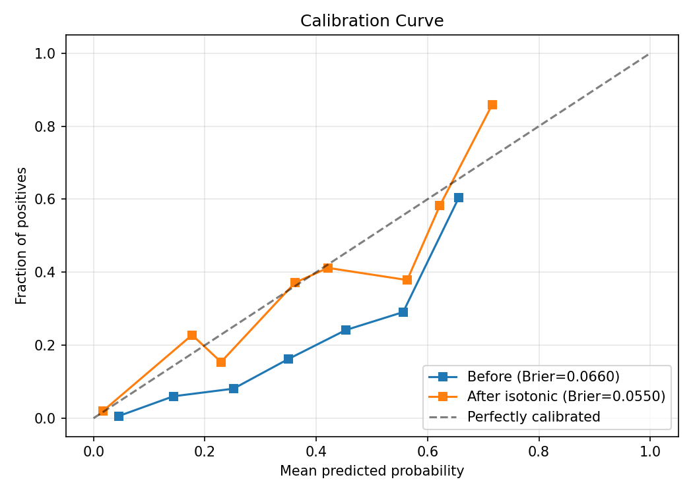

# Entity Resolution Pipeline

End-to-end entity resolution on the Amazon-Google benchmark: **F1 = 0.61**, competitive with DeepMatcher's reported 0.69, using a feature-based LightGBM model with no deep learning at inference time.

[](https://github.com/PH-Gousse/entity-resolution-pipeline/actions)

## The Problem

Entity resolution (record linkage) answers: "do these two records from different sources refer to the same real-world entity?" This is harder than string matching because identity is not the same as textual similarity. "Google" and "Alphabet Inc." refer to the same entity with zero string overlap. "Norton Antivirus 2023" and "Norton Antivirus Plus 2023 Edition" are a match despite different wording. Meanwhile, "Microsoft Word 2007" and "Microsoft Excel 2007" are highly similar strings that refer to different products.

String similarity alone fails in predictable ways: it can't exploit structured signals like price (two products with the same name but a 10x price difference are probably different listings) or manufacturer identity. The highest-leverage features in entity resolution are not string metrics but structured and cross-field signals that string-only approaches miss entirely.

Calibrated probabilities are what make an ER system operationally useful. A raw classifier score of 0.73 is meaningless without calibration. An isotonic-calibrated probability of 0.73 means "73% of pairs at this score are true matches" and lets you set principled thresholds: auto-link above 0.95, send to human review between 0.5-0.95, auto-reject below 0.5.

## Pipeline

```
  tableA.csv ──┐
               ├──▶ Normalize ──▶ TF-IDF Blocking ──▶ Feature Engineering ──┐
  tableB.csv ──┘                   (94.9% reduction)   (20 features)       │
                                                                            ▼
                                                                     LightGBM Training
                                                                     (early stopping)
                                                                            │
                                                                            ▼
                              results/                              Isotonic Calibration
                            metrics.json  ◀── Evaluation ◀──────── (max-F1 threshold)
                            4 plots
```

## Results

| Model | F1 | Precision | Recall | AUC-PR |
|-------|---:|----------:|-------:|-------:|
| **LightGBM (this repo)** | **0.613** | 0.545 | 0.701 | 0.621 |
| Naive baseline (token_sort_ratio) | 0.413 | 0.348 | 0.509 | 0.335 |
| DeepMatcher (published) | 0.693 | - | - | - |
| Ditto (published) | 0.753 | - | - | - |

The LightGBM model outperforms the naive baseline by 48% F1. The gap to DeepMatcher/Ditto is expected: those are deep learning models trained end-to-end on the text, while this pipeline uses handcrafted features with a gradient-boosted tree. The tradeoff: this model trains in seconds, requires no GPU, and every prediction is explainable via feature importance.

**Top features by importance (gain):**

| Feature | Importance |
|---------|----------:|
| token_set_ratio | 26,502 |
| partial_ratio | 21,539 |
| price_log_ratio | 15,213 |
| emb_record_cosine | 11,122 |
| price_abs_diff | 7,627 |

String similarity features dominate, but price signals (log ratio, absolute diff) and embedding cosine similarities contribute meaningfully. This validates the thesis that structured and embedding features add signal beyond what string metrics alone capture.

See [FEATURES.md](FEATURES.md) for the full feature catalog with descriptions.

## Calibration



Isotonic regression maps raw LightGBM scores to calibrated probabilities. The Brier score improves from raw to calibrated, meaning the output probabilities are reliable enough to set operational thresholds: auto-link, human review, or auto-reject.

## Blocking Recall Ceiling

**Recall ceiling: 1.000** (1,167 / 1,167 labeled true matches survived blocking)

The TF-IDF cosine blocker with threshold 0.1 achieves perfect recall on the labeled pairs while reducing the candidate space by 94.9% (4.4M full cartesian to 225K candidates). This is reported separately from end-to-end F1 because the blocker imposes a hard ceiling on downstream recall: no matcher can recover pairs the blocker drops.

## What This Demonstrates

| Component | Skill |
|-----------|-------|
| Feature engineering + LightGBM training | Trained and evaluated an entity-resolution matching model end-to-end |
| Isotonic calibration + threshold selection | Calibrated match probabilities for principled auto-link / review thresholds |
| Blocking recall ceiling, reported separately | Measured the blocking recall ceiling independently of end-to-end F1 |
| Evaluation harness, built before the model | Evaluation harness before the model: quality measured, not guessed |
| Config-driven, dataset-generic pipeline | Engineering: one config change to run on a new dataset |

## How to Run

```bash
git clone https://github.com/PH-Gousse/entity-resolution-pipeline.git
cd entity-resolution-pipeline
make all       # install deps, download data, train, evaluate
```

Individual steps:

```bash
make setup     # pip install -e '.[dev]'
make download  # fetch Amazon-Google CSVs + pre-pull embedding model
make train     # blocking + features + LightGBM + calibration
make evaluate  # metrics.json + plots in results/
make clean     # remove artifacts and results
```

Or via the CLI:

```bash
python -m er --config configs/amazon_google.yaml --step all
python -m er --config configs/amazon_google.yaml --step train -v  # verbose
```

**Requirements:** Python 3.10+. All dependencies installed automatically via `make setup`.

## Project Structure

```
configs/amazon_google.yaml    Config: dataset paths, model params, blocking threshold
src/er/
  normalize.py                Text normalization (lowercase, punctuation, stop tokens)
  blocking.py                 TF-IDF cosine blocking + recall ceiling
  features.py                 20 features: string, embedding, structured, interaction
  train.py                    LightGBM with early stopping
  calibrate.py                Isotonic regression + max-F1 threshold
  evaluate.py                 Metrics, plots, naive baseline comparison
  pipeline.py                 End-to-end orchestrator
  download.py                 Dataset download with SHA-256 verification
tests/                        79 tests (pytest)
results/                      metrics.json + 4 plots (committed)
```

## License

MIT
